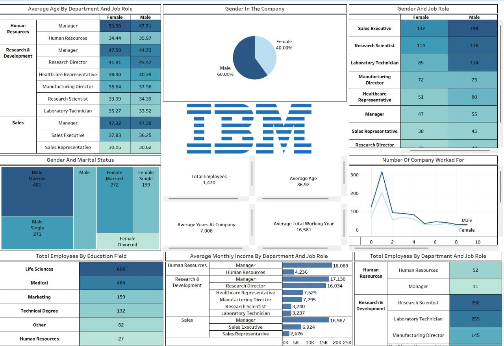

# 👩‍💼 IBM HR Analytics Dashboard (Power BI)

## 📌 Project Overview
This Power BI project presents an **HR Analytics Dashboard** based on the **IBM Employee Dataset**.  
The dashboard provides insights into **employee demographics, gender distribution, age analysis, income patterns, education background, marital status, and workforce trends** to support HR decision-making.

---

## 🖼 Dashboard Preview

---

## 🎯 Objectives
- Analyze employee distribution by **department and job role**
- Understand **gender diversity** across the organization
- Study **average age** by department and role
- Examine **education background** of employees
- Analyze **income trends** by department and role
- Track **employee experience** and company changes

---

## 🛠 Tools & Technologies
- Power BI Desktop  
- Power Query (ETL)  
- DAX (Data Analysis Expressions)  
- IBM HR Analytics Dataset (CSV)

---

## 📊 Key KPIs
- **Total Employees:** 1,470  
- **Average Age:** 36.92 Years  
- **Average Years at Company:** 7.01 Years  
- **Average Total Working Years:** 16.58 Years  
- **Gender Ratio:**  
  - Male: 60%  
  - Female: 40%

---

## 📈 Dashboard Highlights

### 🔹 Demographics Analysis
- Gender distribution across the company
- Gender vs Job Role comparison
- Gender vs Marital Status analysis

### 🔹 Workforce Insights
- Average age by department and job role
- Total employees by department & job role
- Number of companies worked for (experience trend)

### 🔹 Education & Income Analysis
- Employees by education field
- Average monthly income by department and role

---

## 📌 Key Insights
- **Research & Development** has the highest employee count
- **Male employees** form a larger portion of the workforce
- **Life Sciences and Medical** backgrounds dominate education fields
- **Managers and Research Directors** earn the highest average income
- Most employees have worked in **1–2 companies**

---

## 📂 Dataset Details
- Dataset Name: IBM HR Analytics Employee Attrition Dataset  
- Format: CSV  
- Includes:
  - Age, Gender, Marital Status
  - Department & Job Role
  - Education Field
  - Monthly Income
  - Years of Experience

---

## 🚀 How to Use
1. Download the Power BI `.pbix` file  
2. Open using **Power BI Desktop**
3. Interact with visuals using filters and slicers
4. Hover over charts for detailed insights

---

## 📁 Project Type
Power BI Data Analyst Portfolio Project

---

## 👤 Author
**Manish Chaurasia**  
Power BI Data Analyst

---

## 📜 License
This project is intended for **learning, analysis, and portfolio demonstration purposes only**.
